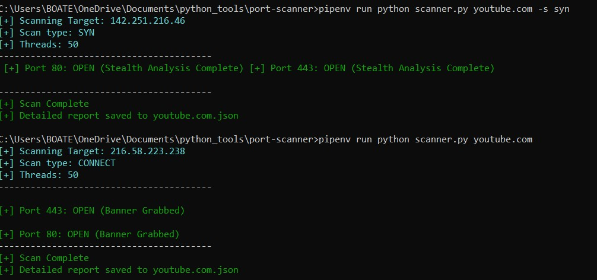

# 🛡️ Multi-Vector Network Scanner

A high-performance, multi-threaded network security tool written in Python. This scanner goes beyond simple port discovery by performing **Service Banner Grabbing** and **TCP Stack Analysis** (TTL/Window Size) to provide deep intelligence on target systems.


## ✨ Features
* **Three Scanning Modes:**
    * **TCP Connect:** Full three-way handshake for reliable service identification.
    * **SYN Stealth:** Half-open scanning using Scapy to bypass simple logging.
    * **UDP Scanning:** Identifies open/filtered ports and captures ICMP error messages.
* **Intelligent Fingerprinting:**
    * Extracts software versions via **Banner Grabbing**.
    * Analyzes Network Stack behavior (**TTL and Window Size**) for OS guessing.
* **High Performance:** Powered by `ThreadPoolExecutor` for concurrent scanning (default 50 threads).
* **Colorized Terminal UI:** Uses `colorama` with a custom `Theme` class for a professional, readable interface.
* **Automated Reporting:** Automatically generates a structured `{target}.json` report.

## 🛠️ Requirements
* **Python 3.12+**
* **Npcap (Windows Only):** Must be installed in "WinPcap API-compatible Mode" to allow raw packet crafting. [Download here](https://npcapcom/).
* **Dependencies:** Install via Pipenv or Pip:
    ```bash pip install scapy colorama ```

## 🚀 Usage

> **⚠️ Warning:** SYN and UDP scans require **Administrator** (Windows) or **Root** (Linux) privileges to craft raw packets.

### 1. Basic TCP Connect Scan
Standard scan for checking if ports are open and grabbing service banners.
```cmd python scanner.py 192.168.1.1 -s connect or python scanner.py 192.168.1.1 -s syn -p 1-1000```

*** Example Output When Runned On a terminal ***



*** 🏗 Project Structure ***
Theme: Manages color-coded terminal output.
parse_ports(): Sanitizes and expands port ranges (e.g., 80,443 or 1-1000).
thread_worker(): The primary execution unit for concurrent scanning and data collection.
get_banner(): Handles service-level communication to retrieve software versions.

*** 📜 Disclaimer ***
This tool is for educational and ethical security testing purposes only. Scanning targets without prior authorization is illegal in most jurisdictions. The author is not responsible for any misuse of this software.